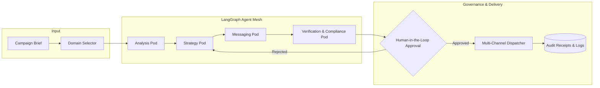

# 🗳️ Campaign Orchestration Platform

> **Autonomous multi-agent campaigning platform powered by LangGraph, FastAPI, and Instructor.**  
> Purpose-built for structured, goal-driven outreach, persuasion, voter mobilization, and multi-channel campaign execution.

---

[](https://fastapi.tiangolo.com)
[](https://langchain-ai.github.io/langgraph/)
[](https://react.dev)
[](https://www.typescriptlang.org/)
[](https://docker.com)
[](LICENSE)

---

## 📌 Overview

A **campaign** is a coordinated, time-bounded effort to influence awareness, perception, support, conversion, or action across a target constituency.

Unlike traditional ad-tech platforms that reduce campaigns exclusively to digital ads and ROAS, this platform is an **agentic campaign engine** designed to model authentic campaigning domains—including **Civic Outreach, Political Action, Grassroots Advocacy, Brand Strategy, Public Affairs, and Custom Campaign Operations**.



---

## 🏛️ Campaign Taxonomy

The platform models campaigns across distinct operational domains:

| Domain | Primary Objective | Target Audience | Core Channels | Key KPIs |
| :--- | :--- | :--- | :--- | :--- |
| **🗳️ Political & Electoral** *(Active)* | Persuasion, volunteer activation, GOTV | Registered voters, district constituents | SMS, Canvassing, Phone Banking, Direct Mail | Voter contacts, Turnout lift, Volunteers recruited |
| **✊ Grassroots Advocacy** *(Active)* | Issue awareness, petition signatures, mobilization | Issue advocates, community members | Email blasts, SMS action alerts, Community townhalls | Signatures collected, Actions taken, Small-dollar donations |
| **📣 Public Affairs & PR** | Narrative discipline, crisis response, media relations | Journalists, policymakers, community leaders | Press releases, Briefing memos, Media pitches | Share of voice, Sentiment score, Media pickup |
| **📈 Marketing & Demand** | Brand perception, demand generation, customer acquisition | Consumers, target personas | Paid Social, Search ads, Content syndication | Reach, CAC, ROAS, Conversion rate |
| **💼 Sales & Account GTM** | Pipeline generation, account expansion | Enterprise decision-makers, ICP accounts | Outbound sequences, SDR scripts, LinkedIn touchpoints | SQLs, Meetings booked, Pipeline value |
| **🏢 Internal Change** | Initiative adoption, compliance, company alignment | Employees, cross-functional teams | Internal briefs, Town halls, Learning modules | Adoption rate, Training completion, Engagement |

---

## 🤖 Multi-Agent Pod Architecture

Workflows execute as stateful graphs in **LangGraph**, where specialized agents collaborate within isolated, single-responsibility pods:

```
src/agents/
├── analysis_pod.py        # Constituency intelligence & historical grounding
├── strategizing_pod.py    # Resource modeling, milestones & variant generation
├── creation_pod.py        # Multi-channel outreach scripts, messaging, and social content generation
├── verification_pod.py    # Hard rules, budget caps, deadline & compliance auditing
└── execution_pod.py       # Live dispatch to third-party channel connectors
```

### 1. Analysis Pod
* **Grounding & Historical Context:** Queries vector storage (**Milvus**) for similar past campaigns, historic voter turnouts, and demographic benchmarks.
* **Voter / Constituency Segmentation:** Segments the target population into distinct cohorts based on priorities and local district dynamics.

### 2. Strategy Pod
* **Goal Decomposition:** Breaks high-level objectives (e.g., "Win 55% vote share") into measurable contact milestones.
* **Budget & Channel Allocation:** Allocates financial caps across SMS, canvassing, phone banking, and digital outreach.
* **Multi-Variant Generation:** Generates competitive tactical variants (e.g., *Grassroots Mobilization* vs. *Digital Air Cover*).

### 3. Messaging Pod
* **Canvassing Scripts:** Generates door-to-door conversational workflows and leave-behinds tailored to segment concerns.
* **Phone Banking Scripts:** Outlines caller prompts, objection handling, and disposition flows.
* **SMS & Email Templates:** Generates character-constrained SMS with automated opt-out compliance footers and long-form email copy.

### 4. Verification & Compliance Pod
* **Budget Math Invariance:** Ensures absolute allocations do not exceed the user's hard budget cap.
* **Election Timeline Auditing:** Validates that all milestones complete prior to election or deadline day.
* **Legal & Regulatory Compliance:** Enforces mandatory disclosures, disclaimer requirements, and consent clauses.

### 5. Human-in-the-Loop (HITL) Pod
* Execution pauses at a state checkpoint. Operators review side-by-side strategy variants, modify parameters, and approve or reject before any external API is touched.

### 6. Execution Pod & Adapters
Dispatches approved variants through pluggable channel adapters:
* 📱 **Twilio Adapter** (`sms_adapter.py`) — Automated SMS broadcast pipelines.
* 🚪 **NGP VAN / MiniVAN Adapter** (`canvassing_adapter.py`) — Field script sync.
* 📞 **CallHub Adapter** (`phone_banking_adapter.py`) — Phone banking campaign ingest.
* ✉️ **SendGrid Adapter** (`email_adapter.py`) — Structured email delivery.

### 7. Lead Generation & CRM Workspace
The platform now includes a lightweight CRM layer for lead collection and campaign follow-up:
* **Lead Capture:** Create and tag leads with source, segment, owner, campaign thread, and freeform notes.
* **CRM Status Tracking:** Move leads through `new`, `qualified`, `nurturing`, `converted`, and `archived` lifecycle states.
* **Interaction Logging:** Record quick notes and interaction history for calls, email, SMS, meetings, and web-form intake.
* **Campaign Linking:** Tie leads back to orchestration thread IDs so outreach strategy and CRM execution stay connected.

### 8. Custom Campaign Support
In addition to the built-in political and advocacy modes, the platform supports a `custom` campaign type with:
* **Custom Labels** for non-standard campaign motions (partner activation, donor sprint, membership drive, etc.)
* **Custom Channels** that feed into planning prompts and budget allocation logic
* **Shared Orchestration** using the same strategy, messaging, verification, approval, and dispatch flow

---

## 🛠️ Technology Stack

| Layer | Technology | Purpose |
| :--- | :--- | :--- |
| **Backend Core** | Python 3.11, FastAPI, Uvicorn | High-performance async REST & WebSocket API |
| **Agent Orchestration** | LangGraph, LangChain | State machine graphs with cyclic branching & HITL checkpoints |
| **Structured Output** | Instructor, Pydantic v2 | Guaranteed schema enforcement for all LLM calls |
| **Vector Database** | Milvus v2.4 + MinIO + Etcd | Historical campaign embedding search & grounding retrieval |
| **State & Memory** | PostgreSQL 16, Redis 7, CouchDB | Relational records, caching, and append-only state history |
| **Frontend** | React 19, TypeScript, Vite | Modern glassmorphism dark-mode control center |
| **Containerization** | Docker, Docker Compose | Single-command microservice orchestration |

---

## 🚀 Getting Started

### Prerequisites
* [Docker Desktop](https://www.docker.com/products/docker-desktop/) (with Compose v2)
* Python 3.11+ (optional for local non-Docker development)
* Node.js 20+ (optional for local frontend development)

### 1. Clone & Configure Environment

```bash
# Clone the repository
git clone https://github.com/your-org/campaigning-agent.git
cd "campagining agent"

# Create .env from template
cp .env.example .env
```

Ensure your `.env` contains your preferred LLM provider keys:

```env
OPENAI_API_KEY=your_openai_key_here
# Or configure Gemini / Anthropic:
LLM_PROVIDER=openai
LLM_MODEL_NAME=gpt-4o

# Optional channel credentials (dry-run mode activates automatically if empty):
TWILIO_ACCOUNT_SID=
TWILIO_AUTH_TOKEN=
TWILIO_FROM_NUMBER=
SENDGRID_API_KEY=
NGP_VAN_API_KEY=
CALLHUB_API_KEY=
```

### 2. Launch with Docker Compose

```bash
docker compose up -d --build
```

### 3. Access Services

| Service | URL | Notes |
| :--- | :--- | :--- |
| **Frontend Control Center** | [http://localhost:5173](http://localhost:5173) | Interactive Campaign Creator & Review Dashboard |
| **Backend REST API** | [http://localhost:8000](http://localhost:8000) | FastAPI application root |
| **Swagger API Docs** | [http://localhost:8000/docs](http://localhost:8000/docs) | Interactive OpenAPI documentation |
| **Milvus Vector DB** | `localhost:19530` | Vector search endpoint |
| **CouchDB Admin** | [http://localhost:5984/_utils](http://localhost:5984/_utils) | NoSQL state document browser |

---

## 📖 API Usage Example

Create a campaign via the REST API:

```bash
curl -X POST http://localhost:8000/api/campaigns \
  -H "Content-Type: application/json" \
  -d '{
    "campaign_name": "Citizens for Clean Water 2026",
    "candidate_name": "Elena Rostova",
    "campaign_type": "advocacy",
    "platform_summary": "Securing bond funding for modern watershed filtration infrastructure.",
    "target_constituency": "County District 4, Registered Voters",
    "messaging_tone": "Urgent, fact-based, community-focused",
    "key_differentiator": "Independent grassroots coalition backed by local hydrologists",
    "opposition": ["Industrial PAC coalition"],
    "budget_cap": 35000.0,
    "days_to_election": 75,
    "election_date": "2026-11-03",
    "district": "4th District",
    "state_or_region": "Michigan",
    "campaign_goals": [
      {
        "objective": "Achieve 60% affirmative vote on Proposition 3",
        "key_results": [
          "Direct contact with 15,000 households via door canvassing",
          "Distribute 50,000 educational SMS notifications",
          "Mobilize 150 local volunteers for election week"
        ]
      }
    ]
  }'
```

---

## 🔒 Security & Compliance

* **Zero Direct Execution:** No third-party dispatch happens without explicit human approval recorded in the audit trail.
* **Regulatory Opt-Outs:** Automated SMS pipelines strictly append compliant `STOP to opt out` footers.
* **Credentials Isolation:** Adapters fail gracefully into safe **Dry-Run mode** whenever production API secrets are omitted.

---

## 📄 License

This project is licensed under the [MIT License](LICENSE).
