# Deep Architectural Research: Google Services Integration (Phase 2 & Phase 3)

Comprehensive architectural design, modern protocols (2025/2026), security patterns, and exact codebase placement for integrating Google Workspace, Gmail, Google Calendar, Google Ads, and GA4 into the B2B Outreach Agent.

---

## Executive Summary & Phasing Blueprint

```mermaid
graph TD
    subgraph Phase 1: Live Intelligence [Phase 1: Active]
        A[Zero-Key Web Search] --> B[Milvus Vector Store]
    end

    subgraph Phase 2: Deliverability & Booking [Phase 2: High Priority]
        C[Gmail 1-to-1 Dispatch] --> D[Prospect Inboxes]
        D --> E[Inbound Replies]
        E --> F[Cloud Pub/Sub Push Webhook]
        F --> G[AI Reply Triage Agent]
        G -->|Interested| H[Google Calendar Auto-Booking]
        G -->|Not Interested| I[Auto-Unsubscribe & Sequence Halt]
    end

    subgraph Phase 3: Omnichannel ABM [Phase 3: Scale]
        J[Targeted Lead List] --> K[Google Ads Customer Match API]
        K --> L[Search & YouTube Retargeting Ads]
        L --> M[GA4 Measurement Protocol]
        M --> N[Closed-Loop Attribution Receipt]
    end
```



---

## Phase 2: Google Workspace, Gmail API & Google Calendar

### 1. 1-to-1 Authenticated Email Dispatch via Gmail API
* **Why Not SendGrid / SMTP for B2B Outbound:**
  * Bulk SMTP providers (SendGrid, Mailgun) use shared/dedicated IP pools tagged as "mass-mailers". B2B spam filters (Google Workspace and Microsoft 365) routinely dump these emails into the "Promotions" or "Spam" folder.
  * Direct API sending through the merchant's real Google Workspace account (`alex@merchant.com`) achieves **95%+ primary inbox placement** because it bears authentic DKIM, SPF, and DMARC alignment from their actual domain.
* **Authentication Pattern:**
  * **Architecture:** OAuth 2.0 Web Application Flow with `access_type=offline`, `prompt=consent`, and incremental auth.
  * **Required Scopes:**
    * `https://www.googleapis.com/auth/gmail.send` (send outbound outreach)
    * `https://www.googleapis.com/auth/gmail.readonly` (read inbound replies for triage)
  * **Token Storage:** Encrypted `refresh_token` stored per merchant in PostgreSQL (`merchant_credentials` table).
* **RFC 2822 Message Thread Continuity:**
  * To ensure follow-ups stack neatly in a single email thread rather than scattering into separate emails:
    1. **Step 1 (First Touch):** Dispatch email with a generated `Message-ID: <uuid@domain.com>`. Store the returned `id` and `threadId` in `execution_receipts`.
    2. **Steps 2+ (Follow-ups):** Set headers:
       * `In-Reply-To: <uuid@domain.com>`
       * `References: <uuid@domain.com>`
       * Pass `threadId: "{threadId}"` in the Gmail API request payload.
* **Safety Throttling & Inbox Warmup:**
  * Standard Google Workspace limits allow up to 2,000 emails/day, but cold email deliverability demands an artificial safety throttle:
    * Maximum **35–50 cold emails per mailbox per day**.
    * Randomized delay jitter (120s to 300s between outbound sends).

### 2. Real-Time Inbound Reply Triage (Cloud Pub/Sub Webhooks)
* **Architecture (Push Model vs Polling):**
  * Do NOT poll Gmail via cron (wastes tokens and hits rate limits).
  * Use **Gmail Watch (`users.watch`)**:
    1. The agent calls `service.users().watch(userId='me', body={'topicName': 'projects/app-id/topics/gmail-replies'})`.
    2. Google Cloud Pub/Sub sends an HTTPS POST notification to our FastAPI server: `POST /api/webhooks/gmail`.
    3. The webhook extracts the message via `historyId`, strips HTML quotes and signature boilerplate, and passes the text to the `reply_triage_agent`.
* **AI Reply Classification Taxonomy:**
  * `POSITIVE_INTEREST` &rarr; Immediately halts remaining cadence steps, notifies the SDR via webhook/Slack, and automatically sends a personalized Google Calendar scheduling link.
  * `NOT_INTERESTED / REMOVE` &rarr; Adds lead to global suppression list and halts sequence.
  * `OUT_OF_OFFICE` &rarr; Extracts return date via regex/LLM and reschedules next sequence step to 2 days after return.
  * `REFERRAL_ALTERNATE_CONTACT` &rarr; Enrolls the referred colleague as a new contact.

### 3. Google Calendar API (Automated Booking)
* **API Version:** Google Calendar API v3 (`calendar/v3`).
* **Workflow:**
  1. `freebusy.query` checks the SDR's availability for the next 5 business days across working hours.
  2. When a prospect confirms a time window, call `events.insert` with:
     * `conferenceDataVersion=1`
     * `conferenceData: {"createRequest": {"requestId": "...", "conferenceSolutionKey": {"type": "hangoutsMeet"}}}`
  3. Google automatically generates a Google Meet video conference link, sends calendar invites to both parties, and attaches the meeting event ID to the campaign execution receipt.

---

## Phase 3: Google Ads API & Omnichannel Retargeting

### 1. Customer Match Audience Sync
* **The Omnichannel Strategy:**
  * Cold outreach works best when combined with paid search and video ads. When an enterprise account or lead is being emailed, we automatically upload their hashed identity to Google Ads so they see display and YouTube ads at the same time.
* **SDK & Protocol (2025/2026):**
  * Use official `google-ads` Python library (v17+).
  * Service: `UserDataService.UploadUserData`
  * Entity: `CustomerMatchUserListMetadata` linked to a `UserList` resource.
* **Data Normalization & Privacy Standards:**
  * Emails must be lowercased, trimmed, and SHA-256 hashed:
    ```python
    import hashlib
    def hash_email(email: str) -> str:
        return hashlib.sha256(email.strip().lower().encode("utf-8")).hexdigest()
    ```
  * Google matches the hashed email against signed-in Google accounts (Gmail, YouTube, Android).

### 2. Closed-Loop Attribution via GA4 Measurement Protocol
* **Endpoint:** `POST https://www.google-analytics.com/mp/collect?measurement_id={GA4_ID}&api_secret={API_SECRET}`
* **Server-to-Server Event Logging:**
  * When an email is dispatched or a meeting is booked, the backend fires server-side GA4 events:
    * `campaign_outreach_sent` (Parameters: `campaign_id`, `variant_id`, `channel: "email"`)
    * `outreach_reply_received` (Parameters: `intent: "positive"`)
    * `b2b_meeting_booked` (Parameters: `value: 500.00`, `currency: "USD"`)
  * This allows the marketing team to see the exact pipeline attribution inside Google Analytics 4.

---

## Codebase Implementation Map

Here is the exact blueprint of where these modules will be added in our project:

```
src/
├── connectors/
│   ├── adapters/
│   │   ├── base_adapter.py             # Existing abstract interface
│   │   ├── email_adapter.py            # Existing mock adapter
│   │   ├── gmail_adapter.py            # [NEW] Phase 2: Gmail 1-to-1 dispatch & thread tracking
│   │   └── google_ads_adapter.py       # [NEW] Phase 3: Customer Match & Ad Group trigger
│   └── google_auth.py                  # [NEW] OAuth 2.0 token management & refresh
├── routers/
│   ├── campaigns.py                    # Existing router
│   └── webhooks.py                     # [NEW] Phase 2: Inbound Pub/Sub reply webhook
├── agents/
│   ├── reply_pod.py                    # [NEW] Phase 2: Inbound classification & triage agent
│   └── execution_pod.py                # [UPDATE] Route dispatch to gmail_adapter / google_ads_adapter
└── services/
    └── calendar_service.py             # [NEW] Phase 2: Google Calendar slot query & Meet generation
```

---

## Technical Prerequisites for Production

1. **Google Cloud Project Requirements:**
   * Google Cloud Project with OAuth Consent Screen configured (**External**, with Production Verification for restricted scopes `gmail.send`).
   * Cloud Pub/Sub Topic created: `projects/{PROJECT_ID}/topics/gmail-inbound-replies`.
2. **Google Ads Requirements:**
   * Approved Google Ads Developer Token with Standard Access (for Customer Match operations).
   * Customer Match policy requires accounts to have a history of good compliance and minimum \$50k lifetime spend (or Google Partner badge) to target Customer Match lists.
